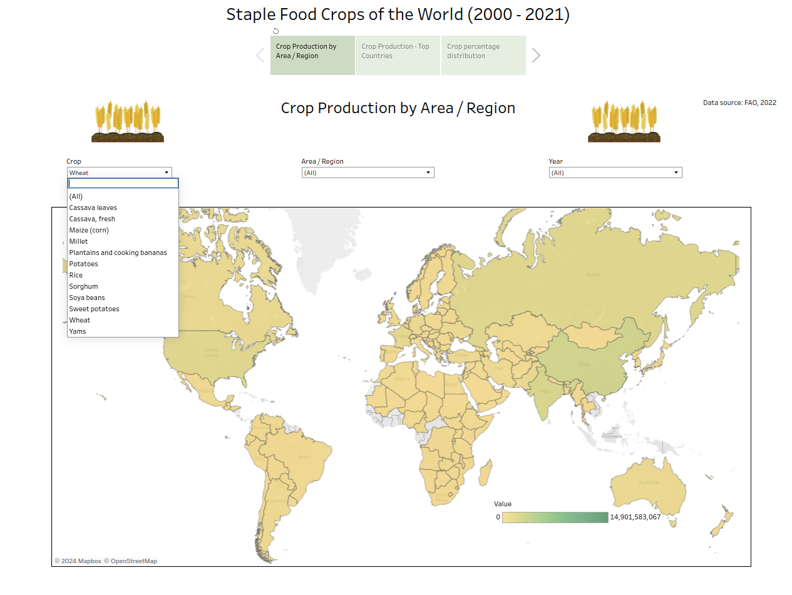
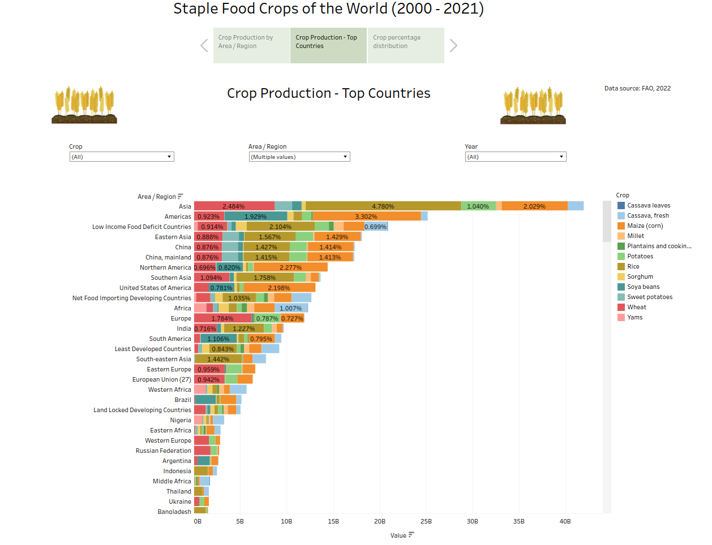
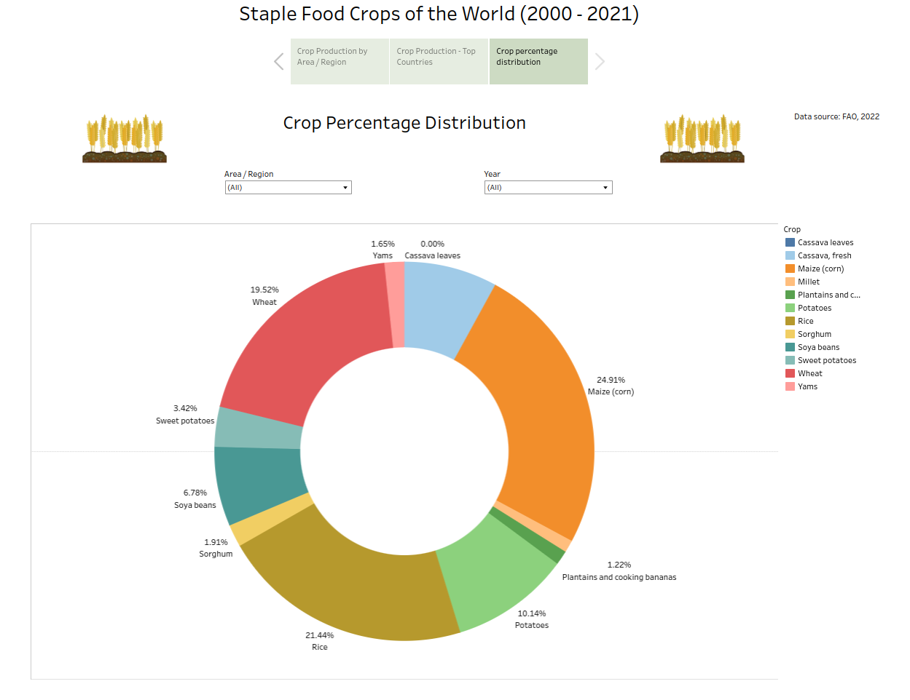
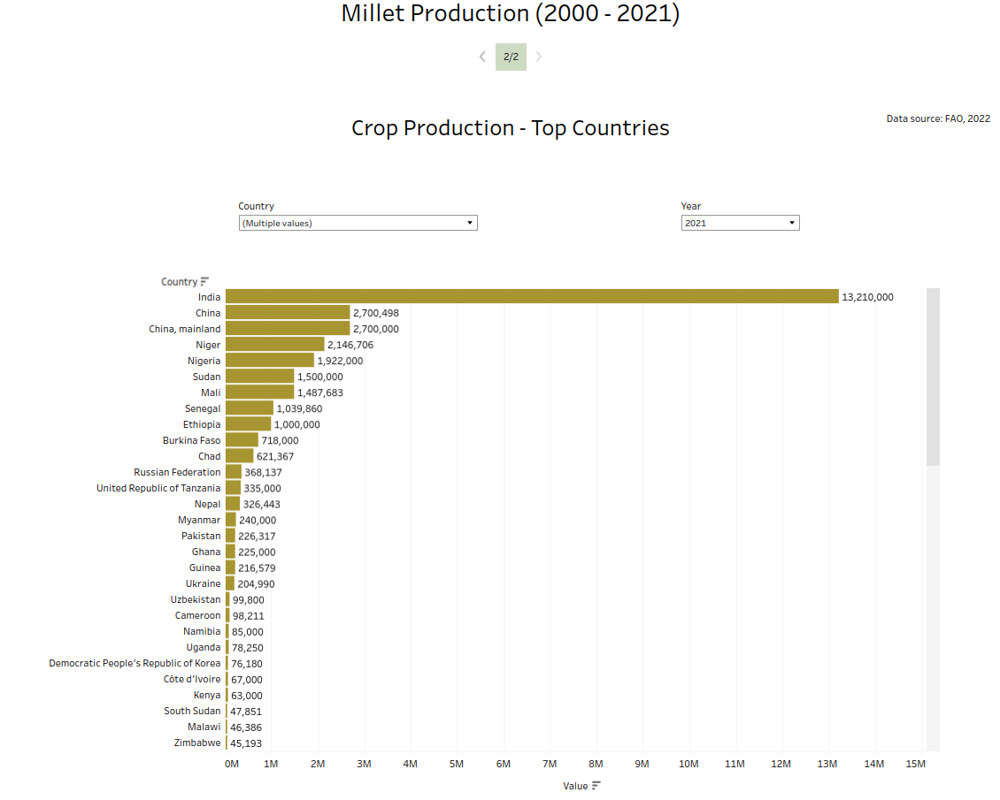
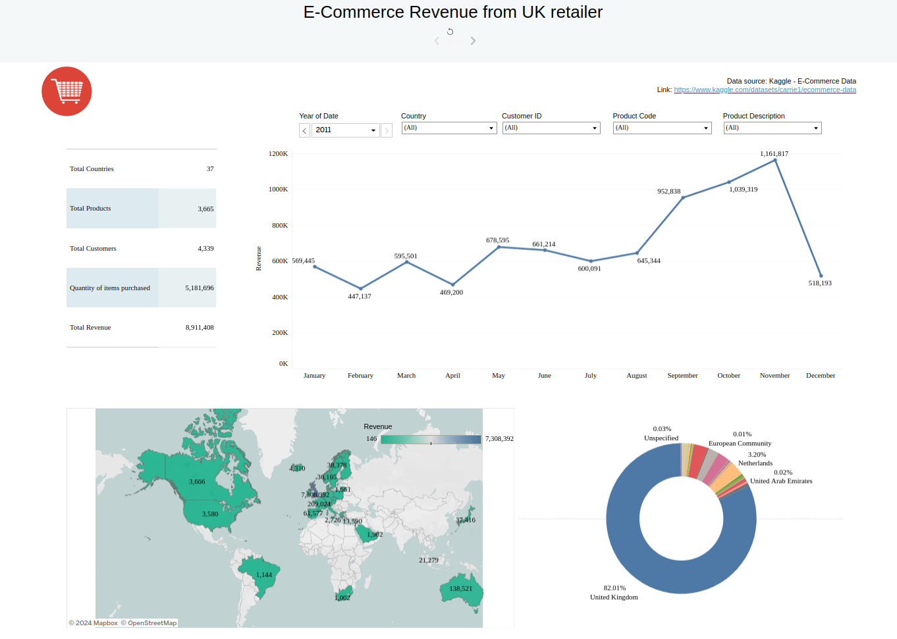
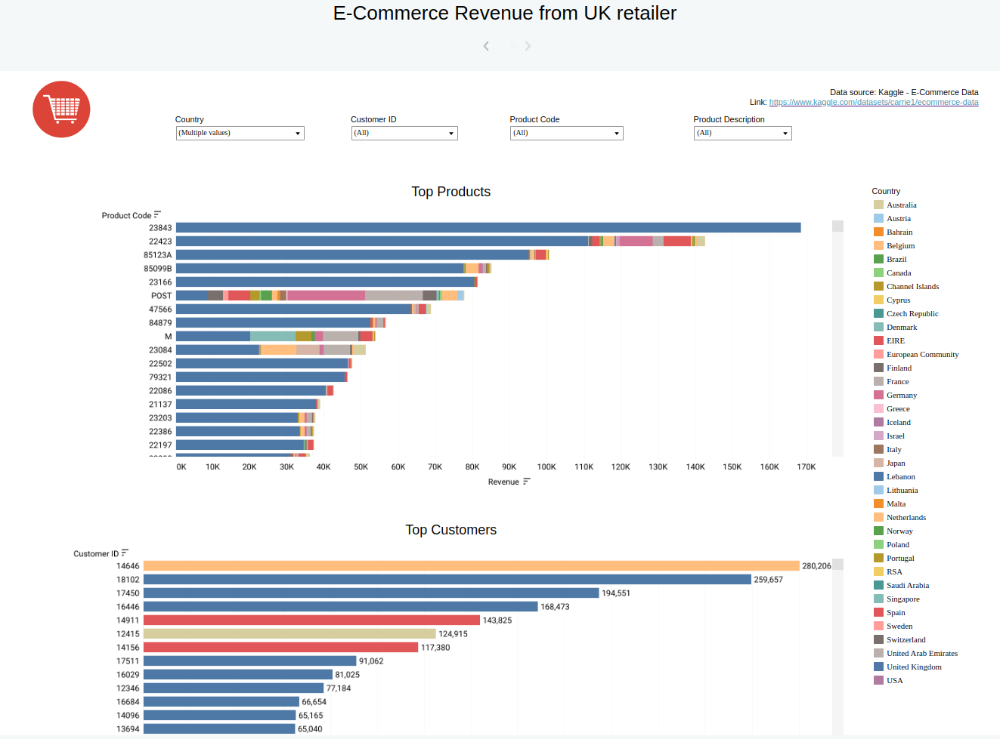
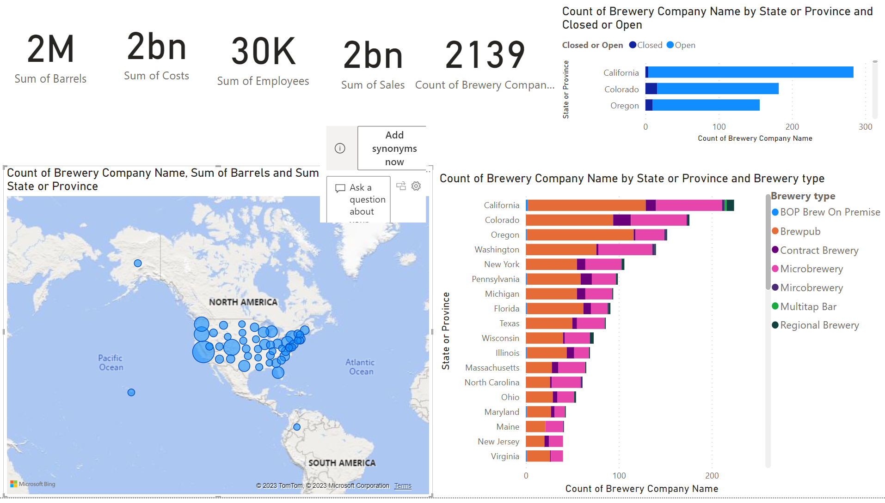
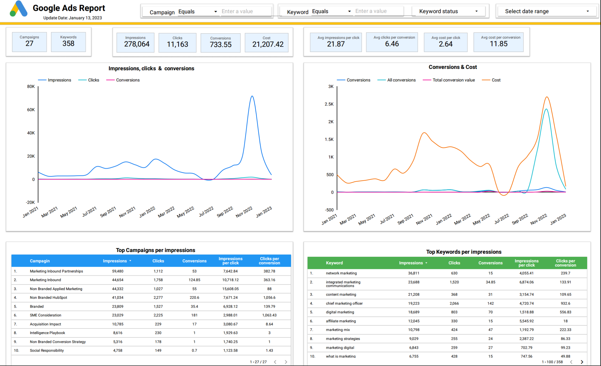

# Data Analysis Portfolio Projects

## Tableau

**Staple Food Crops of the World (2000 - 2021)**

* Tableau Public: [Link](https://public.tableau.com/app/profile/rosalopez/viz/StapleFoodCropsoftheWorld2000-2021/StapleFoodCropsoftheWorld2000-2021)
* Data Source: FAO, 2022 

 

**Millet Production (2000 - 2021)**

* Tableau Public: [Link](https://public.tableau.com/views/Millet_FAO/StapleFoodCropsoftheWorld2000-2021?:language=en-US&:sid=&:redirect=auth&:display_count=n&:origin=viz_share_link)
* Data Source: FAO, 2022 

**E - Commerce-UK**

* Tableau Public: [Link](https://public.tableau.com/views/E-Commerce-UK/Story1?:language=en-US&:sid=&:redirect=auth&:display_count=n&:origin=viz_share_link)
* Dataset in Kaggle: [Link](https://www.kaggle.com/datasets/carrie1/ecommerce-data) 

## SQL & Power BI

* Data Source: [Link](https://github.com/rosa-lpz/SQL%&%PowerBI%-%Breweries/Data) 
* Data processing (SQL script): [Link](https://github.com/rosa-lpz/SQL%&%PowerBI%-%Breweries/SQL_breweries.sql)  

## Google Data Studio

